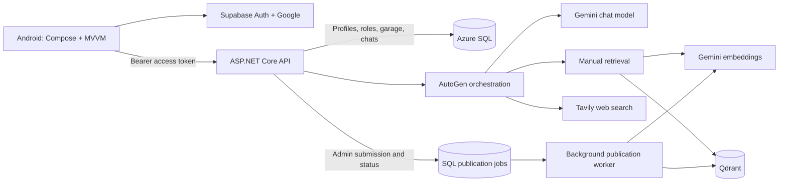

# RideFix Bro

### An AI-powered motorcycle assistant with manual-grounded answers, live web research, and a personal garage

RideFix Bro is a full-stack Android application that connects a rider's motorcycle
and model year to relevant technical documentation. It combines official-manual
retrieval, live web search, camera-assisted questions, and persistent conversations
in a single workspace.

The application uses a **Kotlin and Jetpack Compose frontend**, a **C# / ASP.NET
Core backend**, and **Azure SQL** for application data. A tool-enabled **Microsoft
AutoGen** agent integrates **Google Gemini**, **Qdrant**, and **Tavily** to answer
questions with motorcycle context. Responses use a conversational Hinglish tone
and are instructed to distinguish manual-backed information from web sources and
individual rider experiences.

## Project highlights

- Native Google sign-in through Supabase, with backend JWT validation and SQL-managed roles.
- A catalog-driven personal garage with make, model, and year selection.
- General and bike-specific conversations with persistent history and ownership checks.
- Retrieval-augmented generation using model-year-aware manual keys and vector search.
- Camera image input and Markdown-rendered answers.
- An Admin-only workspace for publishing catalog bikes with their official PDF manuals.
- Versioned manual replacement that keeps incomplete uploads out of search results.
- Quota-aware embedding uploads, cancellation handling, and bounded AI tool execution.

## Technology stack

| Layer | Implementation |
|---|---|
| Android application | Kotlin, Jetpack Compose, Material 3, MVVM, ViewModel, StateFlow, coroutines |
| Mobile networking | Retrofit, OkHttp, Gson |
| Identity | Supabase Auth, native Google sign-in, Android Credential Manager |
| Local session protection | Android Keystore, AES-256-GCM, atomic file writes |
| Backend | C#, ASP.NET Core on .NET 10, dependency injection, REST APIs |
| AI orchestration | Microsoft AutoGen with generated function contracts and custom tool middleware |
| Conversational model | Gemini 3.1 Flash Lite through Google's OpenAI-compatible endpoint |
| Embeddings | `gemini-embedding-2-preview`, 3,072-dimensional vectors |
| Manual retrieval | Qdrant Cloud, vector similarity search, metadata filtering |
| Web research | Tavily search with summaries, source titles, URLs, and excerpts |
| Relational storage | Azure SQL / SQL Server, Entity Framework Core, database-first models |
| PDF processing | PdfPig text extraction and word-based chunking |
| Cloud hosting | Azure App Service; managed-identity-based Azure SQL access |
| API documentation | OpenAPI and Scalar in the development environment |
| Verification | xUnit, SQLite-backed API integration tests, mocked provider HTTP, JUnit, MockK, Compose UI test sources |

## Implemented functionality

### Authentication and account isolation

Google sign-in is handled through Supabase rather than an application-managed
password system. The Android client uses nonce verification during sign-in and
lets the Supabase SDK manage session restoration and token refresh.

The backend validates the access token's issuer, audience, signature, expiry, and
user-session claims. It resolves the application user and role from SQL before
authorizing protected operations. Client-provided role flags are not trusted.

On the device, session data is encrypted with a key held in Android Keystore and
stored outside the app's backup files. Token guards reject expired or
wrong-account sessions. Account-switch and cancellation checks prevent delayed
responses from populating another user's workspace.

Sign-in failures distinguish Google credential retrieval, the Supabase token
exchange, and the backend profile lookup. Errors remain visible across session
initialization and invalidation instead of silently returning to the sign-in
button. The `RideFixAuth` Android log tag records stage and exception type only,
not tokens, account details, nonces, or provider response bodies.

### Personal garage

Riders choose from dependent **Make -> Model -> Year** dropdowns backed by the
master catalog. Garage entries reference catalog bikes rather than accepting
arbitrary motorcycle specifications.

The garage supports listing, adding, and removing bikes. Removal is a soft delete:
the original garage row and its linked conversations remain intact. Adding the
same catalog bike again reactivates that row instead of creating a duplicate.
Different model years remain separate catalog selections.

### Persistent chat workspace

The collapsible sidebar provides access to new chats, saved conversations, the
garage, profile information, and sign-out. Administrators also see the manual
publication entry.

A new conversation requires an explicit **General** or **garage bike** selection
before the composer and camera controls appear. The selection locks after the
first send. Existing conversations obtain their authoritative bike context from
SQL, not from user text or model-generated arguments.

Completed conversations can be reopened across app sessions. The application
supports paginated saved-chat lists, older-message loading, and permanent
owner-authorized chat deletion with a confirmation dialog. Chat titles are
derived from the first user message.

New chats use `sessionId: 0` on the first request. The backend prepares the
context without inserting an empty chat, generates a complete AI turn, and then
saves the chat and its messages in one SQL transaction. A successful response
returns the persistent numeric ID for subsequent messages.

### Manual-grounded AI and web research

The application uses **one tool-enabled agent**, not a multi-agent swarm:

| Tool | Responsibility |
|---|---|
| `SearchManualAsync` | Retrieve passages from the selected bike's published manual |
| `SearchInternetAsync` | Retrieve current facts, official technical references, prices, reviews, and rider discussions |

For bike-specific technical questions, the agent is instructed to consult the
available manual first and use web research when verification, clarification, or
real-world feedback is useful. Its instructions separate **manual findings** from
**internet / rider reports**, require source attribution, and treat community
experiences as anecdotes rather than verified specifications.

General chat retains web search but does not claim manual-backed applicability.
A bike without a mapped manual does not automatically fall back to another
model year's documentation.

Both tools use generated function contracts. The manual tool's model-visible
schema exposes only the search question; the backend supplies the trusted
`ManualKey` and cancellation token through its execution map.

### Camera-assisted questions

The chat screen can capture a camera image and send it alongside a text question.
The backend accepts JPEG and PNG images, checks their actual format, validates
decoded size and pixel dimensions, and passes the image to the conversational
model.

Images are used for the current request rather than stored as persistent files.
Saved history records that an earlier photo is unavailable, and the UI asks the
user to reattach it when needed.

### Admin bike and official-manual publication

The Admin workspace combines catalog creation and official PDF publication in
one form. **Make, Model, Year, ManualKey, and PDF** are required. An optional
`skipPages` value excludes leading physical PDF pages before text extraction.

The publication entry is hidden from non-admin profiles, and the API independently
enforces the **SQL-backed Admin role**. Submission validates the PDF and saves a
durable publication job, returning **202 Accepted** and a job ID. A background
worker performs embedding, publication, cleanup, and catalog saving outside the
HTTP request. Only a **Succeeded** job means the manual and catalog update are
complete; an accepted or fully staged job is not yet a successful publication.

The Admin screen shows progress and recent jobs. It polls while visible and
recovers saved job status when reopened. Uploading the same make, model, year,
and key replaces that manual's previous published content.

The service processes the PDF's text layer, not its diagrams or image pixels.
It rejects empty, malformed, oversized, or image-only documents without usable
text.

## Architecture

RideFix Bro follows a **modular monolith** design: one backend with focused
controllers and services, and an Android client organized around MVVM.



### Conversation lifecycle

1. Validate the authenticated user, message, optional image, and selected chat context.
2. Load a bounded window of complete saved turns while leaving the full SQL history intact.
3. Send the question and selected make, model, and year to Gemini.
4. Validate any requested tools, enforce execution budgets, and run the permitted functions.
5. Return tool results to the model until it produces a final answer.
6. Append the complete turn atomically and return the saved chat ID and answer.

Tool calls and their results are stored together with ordered turn and message
sequence numbers. The serialization layer preserves Gemini tool-call metadata,
including thought signatures, so a reopened conversation can continue the
provider's expected message sequence.

The model's context window and the user's stored history are intentionally
separate. Limiting context does not delete older SQL messages.

### Manual publication lifecycle

```text
Validate PDF and skip count
    -> Extract text into approximately 300-word chunks
    -> Save bounded text and job metadata in SQL
    -> Return 202 Accepted + job ID

Background worker
    -> Load a queued or interrupted job
    -> Generate embeddings and stage its revision
    -> Persist acknowledged chunk checkpoints
    -> Publish the revision by updating its manifest
    -> Remove older revisions belonging to the same ManualKey
    -> Save the catalog result and mark the job Succeeded
```

`ManualPublicationJobs` stores only extracted text while a job is active, not the
raw PDF or its images. The job ID determines the Qdrant revision and deterministic
chunk IDs. After interruption, already acknowledged chunks are verified and
processing continues from the saved checkpoint. A replayed upsert replaces the
same point instead of creating a duplicate.

Terminal jobs clear their temporary text and retain status, progress, and a
safe error or catalog result. A failed job requires a new submission after the
underlying issue is resolved. Already-staged points from older synchronous
uploads are not automatically adopted as jobs.

All manuals share one configured Qdrant collection. Within that collection:

| Metadata | Meaning |
|---|---|
| `manual_key` | Stable identifier mapped to an approved catalog bike/manual set |
| `revision` | Identifier for a particular upload |
| `kind: chunk` | Extracted text, its embedding, and chunk metadata |
| `kind: manifest` | The active published revision for one manual key |

Search filters by **manual key + active revision + chunk type**. This excludes
other bikes, unpublished revisions, and publication metadata from answer
passages.

The manifest is switched only after the new chunks are ready. A failed staging
operation therefore does not replace the previous published manual. Cleanup
targets older revisions of the same key, leaving other manuals untouched. If
publication changes during an empty search result, the reader can retry the
newer revision once.

Publication is serialized by a process-local gate and a SQL application lock for
coordination between backend instances sharing the database. An active-manual
unique index prevents overlapping jobs for the same collection/key.

The worker checks for interrupted jobs at startup and is signaled by submissions
or active-job status reads. It does not continuously poll SQL when idle. Its
shutdown token, not the original HTTP request token, controls execution.

## Reliability and operational controls

### Chat limits

Defaults are defined in `RideFixBro.API\appsettings.json`.

| Setting | Default |
|---|---:|
| Message length | 2,000 characters |
| Decoded image size | 2 MiB |
| Image dimensions | 16,777,216 pixels |
| Chat request body | 3 MiB, including Base64 and JSON |
| Ask requests | 5 per minute per backend instance |
| Concurrent Ask operations | 1, with no waiting queue |
| Model context | 10 complete turns, including the new successful turn |
| Tool rounds per request | 5 |
| Individual tool calls per request | 6 |
| Saved-chat page | 50 chats |
| Visible-message page | 100 messages |

The rate and body-size policies apply to the Ask endpoint rather than every
controller. Cancellation propagates through AI, search, and database operations.
Unique message sequence constraints reject conflicting concurrent writes instead
of committing interleaved turns.

Saved-chat pagination uses a timestamp-and-ID cursor. Message pagination uses
sequence numbers, and loading an older page does not change the chat's
last-updated metadata.

### Upload limits and embedding quotas

| Control | Default |
|---|---:|
| PDF size | 20 MiB |
| PDF pages | 1,000 |
| Extracted chunks | 2,000 |
| Temporary extracted text per job | 16 MiB serialized UTF-16 text |
| Active publication jobs | 3 across the application database |
| Leading pages skipped | 0; configurable from 0 to 999 |
| Upload embedding request budget | 80 requests per rolling window |
| Upload embedding token budget | 24,000 input tokens per rolling window |
| Accounting window | 61 seconds |
| Retries after an embedding `429` | At most 2 for the affected chunk |

Upload pacing reserves estimated capacity before a request and uses
provider-reported input-token usage after success. It respects `Retry-After`
when available and reports persistent quota exhaustion explicitly. This is
separate from the chat request limiter and does not slow Qdrant writes directly.

Normal Android API calls have a 45-second total timeout; chat calls allow
120 seconds. PDF submission allows up to 180 seconds for transfer and text/job
preparation. The worker can process the accepted job independently of that
request; progress is fetched through short status calls.

### Important boundaries

- Local pacing and request limits do not increase provider quotas or account for every other application using the same provider project.
- SQL and Qdrant publication are separate operations, not one distributed transaction. Failures are surfaced rather than reported as successful catalog creation.
- The backend process must be running for background work to advance. Free/shared-tier idle unloading, restarts, or shutdowns can pause it; saved checkpoints enable recovery rather than guaranteeing continuous execution.
- PDF transfer and text extraction remain request-bound. Provider quotas, hosting resource limits, and database availability still apply to background work.
- A database commit and delivery of its HTTP response are separate events. A lost response can leave the client uncertain; chat sends are not automatically replayed.
- Manual applicability depends on accurate catalog mappings and source documents. Model-generated guidance is not a substitute for a qualified mechanic or verified manufacturer procedures.

## API surface

Except for development documentation, application endpoints require a valid
Supabase access token. User-owned resources are resolved from the authenticated
SQL user, not a supplied owner ID.

| Method | Route | Access | Purpose |
|---|---|---|---|
| `GET` | `/api/me` | Authenticated | Current profile, display name, email, and SQL role |
| `GET` | `/api/bikes` | Authenticated | Master make/model/year catalog |
| `GET` | `/api/garage` | Owner | Active garage entries |
| `POST` | `/api/garage` | Owner | Add or reactivate a catalog bike |
| `DELETE` | `/api/garage/{id}` | Owner | Soft-delete a garage entry |
| `POST` | `/api/Chat/ask` | Owner | Start or continue a conversation |
| `GET` | `/api/chats` | Owner | List saved chats using `beforeId` and `beforeUpdatedAt` |
| `GET` | `/api/chats/{id}` | Owner | Load messages using optional `beforeSequence` |
| `DELETE` | `/api/chats/{id}` | Owner | Permanently delete a chat and its messages |
| `POST` | `/api/admin/bikes` | Admin | Submit a bike/PDF publication job; returns `202` |
| `POST` | `/api/admin/bikes/{bikeId}/manual` | Admin | Submit a replacement job for an existing catalog bike; returns `202` |
| `GET` | `/api/admin/manual-jobs` | Submitting Admin | Latest 20 publication jobs, excluding source text |
| `GET` | `/api/admin/manual-jobs/{id}` | Submitting Admin | Job state, staged/total chunks, error, and result bike ID |

**ID distinction:** catalog operations use `MasterBikes.Id`, garage operations
use `UserBikes.Id`, and conversations use `ChatSessions.Id`.

For a new General conversation:

```json
{
  "sessionId": 0,
  "message": "What should I consider when choosing a riding jacket?",
  "isGeneral": true
}
```

For a new bike-specific conversation, provide the garage entry's `userBikeId`
instead of selecting General. Subsequent messages use the returned numeric
`sessionId`. The server retains the saved selection.

Admin publication uses multipart form data:

| Field | Requirement |
|---|---|
| `make` | Required; up to 100 characters |
| `model` | Required; up to 100 characters |
| `year` | Required; 1900-2100 |
| `manualKey` | Required; up to 128 characters |
| `file` | Required PDF |
| `skipPages` | Optional; `7` begins extraction at physical page 8 |

Errors distinguish invalid input, authentication/authorization failures, missing
resources, conflicts, oversized requests, exhausted tool budgets, provider
throttling, and database/provider unavailability. Internal exception details
remain in server logs.

## Configuration reference

Backend credentials belong in development or hosting configuration and must not
be committed to source control or embedded in the Android application. Public
client identifiers and adjustable runtime budgets are listed separately below.

| Location | Key | Purpose |
|---|---|---|
| Backend | `ConnectionStrings:DefaultConnection` | Application SQL connection, including the deployment's authentication mode |
| Backend | `Supabase:ValidIssuer` | Supabase project's HTTPS `/auth/v1` issuer |
| Backend | `Supabase:ValidAudience` | Expected JWT audience: `authenticated` |
| Backend | `API_Keys:Gemini_Api_key` | Gemini chat and embedding access |
| Backend | `API_Keys:Tavily_Api_key` | Web-search access |
| Backend | `Qdrant_Vector_DB:Cluster_Endpoint` | Qdrant host |
| Backend | `Qdrant_Vector_DB:API_Key` | Qdrant access |
| Backend | `Qdrant_Vector_DB:ManualCollection` | Required shared official-manual collection; no fallback name |
| Backend | `Chat:*` | Chat input, concurrency, history-window, and tool budgets |
| Backend | `EmbeddingUpload:*` | Upload request/token pacing budgets |
| Android public configuration | `SUPABASE_URL`, `SUPABASE_PUBLISHABLE_KEY`, `GOOGLE_WEB_CLIENT_ID` | Sign-in integration |
| Android networking | `RideFixBroClient.BASE_URL` | Backend API address |

Azure App Service configuration uses double underscores for nested keys, such as
`Qdrant_Vector_DB__ManualCollection`. Gemini, Tavily, Qdrant, and database
credentials are backend-only; the Android sign-in settings are public client
configuration.

## Repository guide

| Path | Responsibility |
|---|---|
| `RideFixBro.API\Controllers` | Authenticated HTTP endpoints, resource ownership, and request handling |
| `RideFixBro.API\Common` | Shared chat input validation and application exceptions |
| `RideFixBro.API\Configuration` | Chat budgets, API timeouts, and the request-body limit attribute |
| `RideFixBro.API\Services` | Chat orchestration, user profiles, saved-chat queries, and garage logic |
| `RideFixBro.API\Services\AgentToolsService` | Tavily web search and Qdrant manual retrieval/publication |
| `RideFixBro.API\Services\BackgroundProcess\ManualPublish` | Durable job submission/status handling and the hosted publication worker |
| `RideFixBro.API\Services\BackgroundProcess\ManualPublish\Helper` | Worker wake-up queue, SQL publication locks, and embedding quota pacing |
| `RideFixBro.API\Services\BackgroundProcess\ManualPublish\Interface` | The manual-publisher contract used by the worker |
| `RideFixBro.API\Agents` | AutoGen agent setup, generated tool contracts, and execution middleware |
| `RideFixBro.API\Agents\Helper` | Gemini message conversion and OpenAI-compatible client construction |
| `RideFixBro.API\Authentication` | Supabase token validation and trusted application claims |
| `RideFixBro.API\DataStore` | Ordered SQL history persistence and provider-message serialization |
| `RideFixBro.API\Models\ChatModels` | Chat request/response DTOs and internal chat/bike context |
| `RideFixBro.API\Models\GarageModels` | Bike catalog and garage DTOs |
| `RideFixBro.API\Models\ManualPublishModels` | PDF submission DTOs, publication work, job responses, and status values |
| `RideFixBro.Data\Entities` | Database-first EF Core context and scaffolded entities |
| `RideFixBro.Data\Scripts` | Reviewable SQL schema and access scripts |
| `RideFixBro.AndroidUI\RideFixBro\app` | Android UI, ViewModels, authentication, networking, and tests |
| `RideFixBro.API.Tests` | Backend unit and API integration tests |

The relational model separates application data in `RideFix` from catalog data
in `RideFix_Customs`. Its core entities are users, roles, catalog bikes, garage
bikes, chat sessions, ordered messages, and durable manual-publication jobs.
Database changes follow reviewed SQL scripts and scaffolding rather than
hand-editing generated entity files.

## Verification

Backend regression coverage includes authentication and ownership, garage
reactivation, first-turn save rollback, chat deletion, stable pagination,
tool-call sequencing, preserved Gemini signatures, cancellation, input limits,
Admin publication validation, checkpoint recovery, terminal job states, and embedding-quota timing.

Android unit tests cover session transitions, account-switch isolation, chat
selection, saved history, deletion, pagination, Admin form validation, job polling/recovery, and
request/response serialization. Instrumented Compose test sources cover garage
and sidebar interactions.

From the repository root:

```powershell
dotnet test .\RideFixBro.API\RideFixBro.API.slnx --configuration Release
```

With the Android project's declared JDK and SDK toolchain available:

```powershell
Set-Location .\RideFixBro.AndroidUI\RideFixBro
.\gradlew.bat :app:testDebugUnitTest :app:assembleDebug :app:lintDebug
```

Backend tests use isolated databases, test doubles, and recorded provider
responses rather than live provider quota. JVM tests, UI compilation, and
mocked API tests are distinct from physical-device and deployed-service checks.

### Publication smoke check

Use matching backend and Android versions: PDF submission now returns a job
response, not a completed publication result.

1. With an Admin account, submit a small text-based PDF and confirm the API returns `202` with a job ID.
2. Observe `Queued` / `Processing` and chunk progress. Reopen the Admin screen to verify that it recovers the same saved job.
3. Wait for `Succeeded`; a complete chunk count alone is not proof that finalization and catalog saving finished.
4. Verify the catalog bike is available, add it to the garage, and ask a bike-specific question covered by the manual.

If a job becomes `Failed`, inspect its reported error and server logs before
submitting again. Do not manually activate a revision containing incomplete
chunks. Hosting idle/restart limitations still apply as described above.

## License

The application source is distributed under the MIT License. See `LICENSE`.
Third-party manuals and other uploaded documents retain their respective rights;
only process material you are authorized to use.
